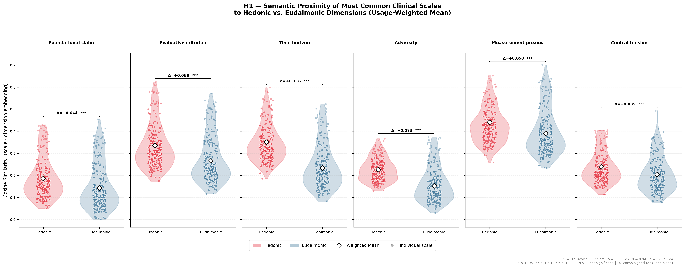
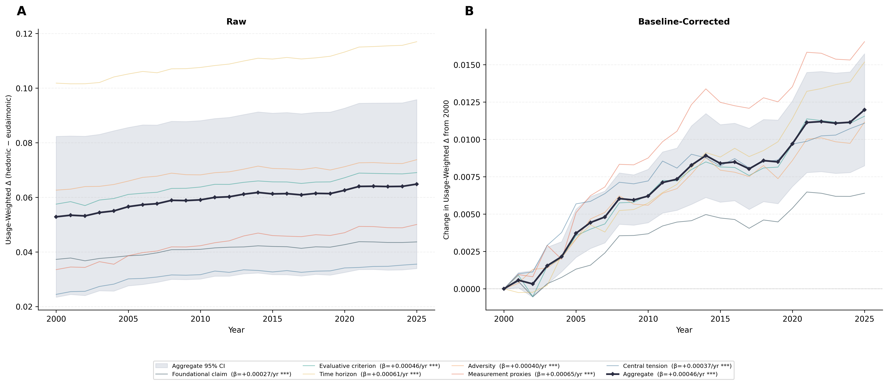

<div align="center">

# 🧠 Hedonic Bias in the Conceptualisation of Patient Progress in Well-Being

### Evidence for Convergence Toward Hedonic Optimisation in Western Mental Healthcare

[](https://github.com/stvsever/research_paper_on_eudaimonia_in_healthcare/blob/main/src/v2/paper/main.tex)
[](LICENSE)
[](https://www.python.org/)
[](docker/)

**Stijn Van Severen<sup>1,\*</sup> · Thomas De Schryver<sup>1</sup>**

<sup>1</sup> Ghent University · <sup>\*</sup> Corresponding author

---

</div>

## 📋 Table of Contents

- [Abstract](#-abstract)
- [Key Findings](#-key-findings)
- [Repository Structure](#-repository-structure)
- [Setup & Installation](#-setup--installation)
- [Usage](#-usage)
- [Pipeline Overview](#-pipeline-overview)
- [Figures](#-figures)
- [Citation](#-citation)
- [License](#-license)

---

## 📝 Abstract

Clinical psychology relies on standardised psychometric scales to assess well-being, distress, and functioning, yet philosophical and empirical work increasingly distinguishes two irreducible traditions: the **hedonic** tradition (pleasure, positive affect, satisfaction) and the **eudaimonic** tradition (meaning, purpose, virtue, personal growth).

Using OpenAI's `text-embedding-3-large` model, we embedded **189 widely used clinical scales** alongside six theoretically derived hedonic–eudaimonic dimension pairs and computed cosine-similarity differentials (Δ) to quantify the degree to which Western clinical assessment over-represents hedonic constructs.

> **Main result:** A large and consistent hedonic bias — mean Δ = +0.053, Cohen's *d* = 0.94, *p* < .001 — robust to usage-weighting, corpus-size variation, and permutation testing. Temporal analysis (2000–2025) revealed this bias has **increased** over the past quarter-century.

---

## 🔬 Key Findings

### H1 — Hedonic Bias Across All Scales (Usage-Weighted)

<div align="center">


*Figure 1. Usage-weighted cosine-similarity differentials (Δ) across all 189 clinical scales. Positive values indicate hedonic bias. All six dimensions show significant positive shifts (Cohen's d = 1.31, p < .001).*
</div>

### H2 — Temporal Trend (2000–2025)

<div align="center">


*Figure 2. Temporal evolution of hedonic–eudaimonic differentials (2000–2025). All six dimensions show positive slopes, confirming a broad-based temporal increase in hedonic bias (aggregate slope = +4.59e-04/year, p < .0001).*
</div>

---

## 📁 Repository Structure

```
research_paper_on_eudaimonia_in_healthcare/
├── README.md
├── LICENSE
├── CITATION.cff
├── requirements.txt
├── .env.example
├── .gitignore
│
├── docker/
│   ├── Dockerfile
│   └── docker-compose.yml
│
└── src/
    ├── v1/                          # Initial prototype (3-step pipeline)
    │   ├── run_pipeline.py
    │   ├── data/
    │   ├── src/
    │   ├── outputs/
    │   └── figures/
    │
    └── v2/                          # ✅ Main codebase (8-step pipeline)
        ├── run_pipeline.py          # Entry point
        ├── data/
        │   ├── dimensions/          # Hedonic & eudaimonic dimension texts
        │   ├── domains/             # Domain assignment mappings
        │   └── scales/              # 200+ clinical scale descriptions
        ├── src/
        │   ├── fetch_usage.py       # PubMed usage counts (2000–2025)
        │   ├── embed.py             # OpenAI embedding generation
        │   ├── analyze_h1.py        # Hypothesis 1: hedonic bias
        │   ├── analyze_h2.py        # Hypothesis 2: temporal trend
        │   ├── analyze_posthoc.py   # Post-hoc analyses
        │   ├── visualize_h1.py      # H1 figures
        │   ├── visualize_h2.py      # H2 figures
        │   └── visualize_domains.py # Domain-level figures
        ├── outputs/                 # Generated CSVs, JSONs
        ├── figures/                 # Generated PDFs & PNGs
        └── paper/
            └── main.tex             # LaTeX manuscript
```

> **Note:** `src/v2/` is the **main and final codebase** used for all results reported in the paper. `src/v1/` contains the initial prototype and is included for reproducibility and historical reference.

---

## ⚙️ Setup & Installation

### 🔧 Option A — Local (pip)

```bash
# 1. Clone the repository
git clone https://github.com/stvsever/research_paper_on_eudaimonia_in_healthcare.git
cd research_paper_on_eudaimonia_in_healthcare

# 2. Create a virtual environment
python3.11 -m venv .venv
source .venv/bin/activate

# 3. Install dependencies
pip install -r requirements.txt

# 4. Configure your environment
cp .env.example .env
# Edit .env and add your OpenAI API key
```

### 🐳 Option B — Docker (recommended for full reproducibility)

```bash
# 1. Clone the repository
git clone https://github.com/stvsever/research_paper_on_eudaimonia_in_healthcare.git
cd research_paper_on_eudaimonia_in_healthcare

# 2. Configure your environment
cp .env.example .env
# Edit .env and add your OpenAI API key

# 3. Build and run via Docker Compose
cd docker
docker compose up --build

# Outputs will be written to src/v2/outputs/ and src/v2/figures/
```

**Or build and run manually:**

```bash
# Build the image
docker build -f docker/Dockerfile -t eudaimonia-pipeline .

# Run the container
docker run --env-file .env \
  -v $(pwd)/src/v2/outputs:/app/src/v2/outputs \
  -v $(pwd)/src/v2/figures:/app/src/v2/figures \
  eudaimonia-pipeline
```

---

## 🚀 Usage

### Run the full v2 pipeline (main codebase)

```bash
# Local
python src/v2/run_pipeline.py

# Docker
docker compose -f docker/docker-compose.yml up --build
```

The v2 pipeline executes 8 steps in sequence:

| Step | Description |
|------|-------------|
| 1/8 | Fetch PubMed usage counts for 200+ scales (2000–2025) |
| 2/8 | Generate embeddings (OpenAI `text-embedding-3-large`) |
| 3/8 | H1 analysis: 4 sub-analyses (top-N raw/weighted, all raw/weighted) |
| 4/8 | H2 analysis: per-dimension temporal trend |
| 5/8 | Post-hoc: domains, permutation, sensitivity, scatter |
| 6/8 | H1 visualisation (violin plots + effect sizes) |
| 7/8 | H2 visualisation (temporal dimension trends) |
| 8/8 | Post-hoc visualisation (domains, permutation, sensitivity) |

### Run the v1 pipeline (initial prototype)

```bash
python src/v1/run_pipeline.py
```

---

## 🔄 Pipeline Overview

```
┌──────────────────────────────────────────────────────────────────┐
│                       PubMed E-utilities                        │
│               (annual publication counts, 2000–2025)            │
└───────────────────────────┬──────────────────────────────────────┘
                            ▼
┌──────────────────────────────────────────────────────────────────┐
│                 OpenAI text-embedding-3-large                   │
│          (189 scales + 6 hedonic–eudaimonic dimension pairs)    │
└───────────────────────────┬──────────────────────────────────────┘
                            ▼
              ┌─────────────┼─────────────┐
              ▼             ▼             ▼
        ┌──────────┐  ┌──────────┐  ┌──────────────┐
        │    H1    │  │    H2    │  │   Post-hoc   │
        │  Hedonic │  │ Temporal │  │  Robustness  │
        │   Bias   │  │  Trend   │  │   Checks     │
        └────┬─────┘  └────┬─────┘  └──────┬───────┘
             ▼             ▼               ▼
        ┌──────────────────────────────────────────┐
        │          Figures & Statistics             │
        │     (PDFs, PNGs, CSVs, JSONs)            │
        └──────────────────────────────────────────┘
```

---

## 📊 Figures

All generated figures are saved to `src/v2/figures/` in both PDF and PNG formats:

| Figure | Description |
|--------|-------------|
| `h1_violin_all_weighted.png` | Usage-weighted hedonic bias across all scales |
| `h1_four_panel.png` | 2×2 panel comparing all four H1 sub-analyses |
| `h1_effect_sizes.png` | Cohen's *d* effect sizes per dimension |
| `h2_combined.png` | Temporal trends across all dimensions (2000–2025) |
| `h2_dimension_trends.png` | Per-dimension temporal trend lines |
| `posthoc_permutation.png` | Permutation test null distribution |
| `posthoc_sensitivity_n.png` | Sensitivity to corpus size (top-N) |
| `posthoc_domain_combined.png` | Domain-level analysis |

---

## 📖 Citation

If you use this code, data, or findings in your work, please cite:

### APA 7

> Van Severen, S., & De Schryver, T. (2026). Hedonic bias in the conceptualisation of patient progress in well-being: Evidence for convergence toward hedonic optimisation in Western mental healthcare. *Ghent University*. https://github.com/stvsever/research_paper_on_eudaimonia_in_healthcare

### BibTeX

```bibtex
@article{vanseveren2026hedonic,
  title   = {Hedonic Bias in the Conceptualisation of Patient Progress in
             Well-Being: Evidence for Convergence Toward Hedonic Optimisation
             in Western Mental Healthcare},
  author  = {Van Severen, Stijn and De Schryver, Thomas},
  year    = {2026},
  institution = {Ghent University},
  url     = {https://github.com/stvsever/research_paper_on_eudaimonia_in_healthcare}
}
```

A machine-readable citation is also available in [`CITATION.cff`](CITATION.cff).

---

## 📜 License

This project is licensed under the **MIT License** — see the [LICENSE](LICENSE) file for details.

You are free to use, modify, and distribute this code for any purpose, including commercial and academic use.

---

<div align="center">

Made with 🧠 at **Ghent University**

</div>
